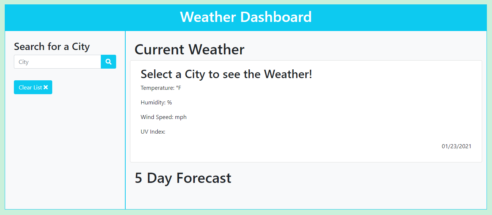
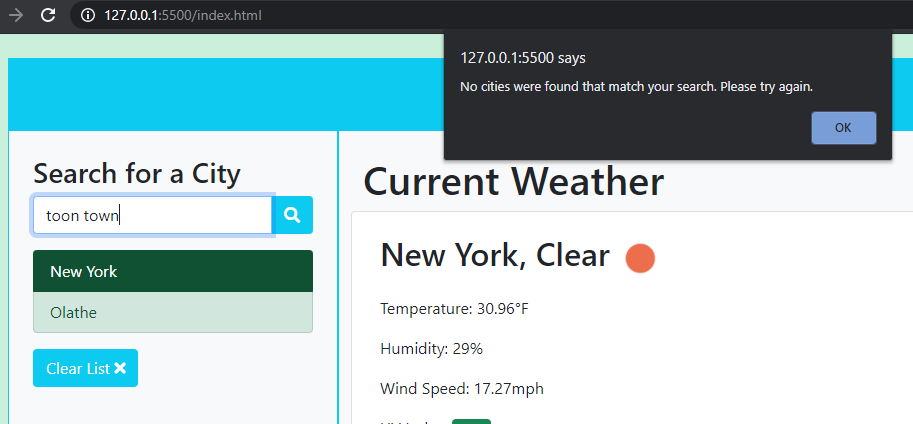

# Weather Dashboard

https://bmcleod12.github.io/light-as-a-weather/

## Description

## Installation

## Usage

Follow this link: https://bmcleod12.github.io/light-as-a-weather/ and you will land on an empty weather dashboard:

Use the search bar to pull up weather information on that city for today and the next 5 days. A description of the current weather, along with an icon, is presented on screen.

As you continue to search for cities, they will be added to the left side panel. Click on any of these previously searched cities to run the search again and pop that city to the top of the list.

If you search for a city that is not available in the Weather API, a message is presented to you in the browser.

After refreshing your page in the browser, the list of cities you previously searched for remains available for your selection. You can clear the list using the button at the bottom of the left panel to start fresh.

## Tests and Known Issues

Test 1:
Open this application in different browsers and change the viewport size to confirm the page elements are responsive.

Test 2:
Search for cities that are not real to confirm no unfound cities are added to the left search history.

Test 3:
Search for cities with varying capitalization (ex: nEw YOrk) and confirm that the capitalization is corrected when added to the search history.

## Credits

The EPA's site for the UV Index scale was used to determine which color of badges to display based on the UV Index for the day: https://www.epa.gov/sunsafety/uv-index-scale-0

## License

MIT License

Copyright (c) 2021 KU Boot Camp

Permission is hereby granted, free of charge, to any person obtaining a copy
of this software and associated documentation files (the "Software"), to deal
in the Software without restriction, including without limitation the rights
to use, copy, modify, merge, publish, distribute, sublicense, and/or sell
copies of the Software, and to permit persons to whom the Software is
furnished to do so, subject to the following conditions:

The above copyright notice and this permission notice shall be included in all
copies or substantial portions of the Software.

THE SOFTWARE IS PROVIDED "AS IS", WITHOUT WARRANTY OF ANY KIND, EXPRESS OR
IMPLIED, INCLUDING BUT NOT LIMITED TO THE WARRANTIES OF MERCHANTABILITY,
FITNESS FOR A PARTICULAR PURPOSE AND NONINFRINGEMENT. IN NO EVENT SHALL THE
AUTHORS OR COPYRIGHT HOLDERS BE LIABLE FOR ANY CLAIM, DAMAGES OR OTHER
LIABILITY, WHETHER IN AN ACTION OF CONTRACT, TORT OR OTHERWISE, ARISING FROM,
OUT OF OR IN CONNECTION WITH THE SOFTWARE OR THE USE OR OTHER DEALINGS IN THE
SOFTWARE.
